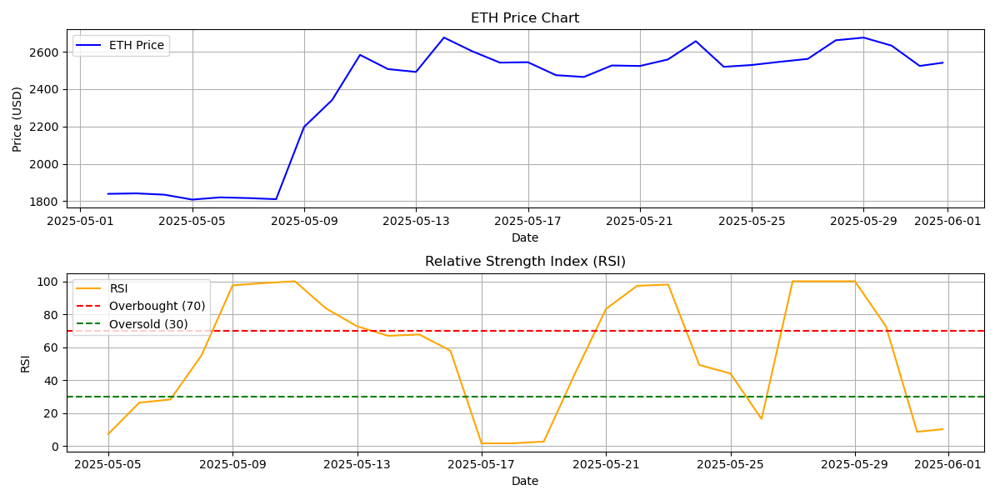

# 📈 AI-Enhanced RSI Trading Signal Bot

A modular, production-ready **Python trading signal generator** that:
- Uses the **Relative Strength Index (RSI)** to detect buy/sell/hold signals
- Fetches real-time ETH prices from **CoinGecko**
- Sends actionable alerts via a **Telegram bot**
- Generates an RSI + Price chart
- Runs every 6 hours using **GitHub Actions**

---

## 🚀 Features

✅ Real-time ETH price feed via CoinGecko  
✅ RSI-based BUY/SELL/HOLD signal strategy  
✅ Logs signals with timestamp  
✅ RSI & Price chart generation using `matplotlib`  
✅ Telegram bot alerts with signal details  
✅ Scheduled automation via GitHub Actions  
✅ Modular codebase – extendable to multi-token and multi-strategy setups

---

## 📦 Folder Structure

```

.
├── app.py                      # Main execution logic
├── core/
│   ├── indicators.py           # RSI calculation
│   ├── models.py               # Token, Signal, Strategy classes
│   ├── price\_source.py         # CoinGecko integration
│   ├── processor.py            # Signal generation + logging
│   └── telegram.py             # Telegram messaging integration
├── visual/
│   └── chart.py                # RSI chart generation
├── logs/
│   └── signal\_log.txt          # Timestamped signal logs
├── visual/rsi\_chart.png        # Saved plot
├── requirements.txt            # Python dependencies
└── .github/workflows/
└── trading\_signal.yml      # GitHub Actions workflow

````

---

## 🧠 How It Works

1. Fetches latest 30-day ETH prices via CoinGecko API
2. Calculates the RSI (default window: 14)
3. Classifies signal:
   - RSI < 30 → BUY
   - RSI > 70 → SELL
   - Otherwise → HOLD
4. Logs the signal to file
5. Sends the signal to Telegram
6. Generates and saves a dual-panel chart (Price + RSI)
7. Repeats every 6 hours via GitHub Actions

---

## 🛠️ Setup Instructions

### 🔧 1. Clone and Install

```bash
git clone https://github.com/your-username/trading-signal-bot.git
cd trading-signal-bot
pip install -r requirements.txt
````

### 🔐 2. Add GitHub Secrets

Go to **Settings → Secrets → Actions** and add:

* `BOT_TOKEN`: Telegram Bot API token from @BotFather
* `CHAT_ID`: Your Telegram user ID (via @userinfobot)

---

## 🤖 Run Locally

```bash
python app.py
```

---

## ☁️ Automation via GitHub Actions

Runs every **6 hours automatically**.
Also manually triggerable from the **Actions** tab.

---

## 📊 Example Output

Telegram Message:

```
📊 Trading Signal Alert
Token: ETH
Action: HOLD
Price: $2,537.02
Time: 2025-05-31 17:05:07
```



---

## 💡 Future Enhancements

* [ ] Support for BTC, SOL, MATIC
* [ ] Add MACD strategy support
* [ ] Telegram chart delivery
* [ ] CSV + SQLite logging
* [ ] Portfolio dashboard via Streamlit

---

## 🤝 Contributions

Pull requests welcome!
Feel free to fork, extend, or use this for hackathons and quant finance research.

---

## 📜 License

MIT License – free to use, modify, and share.
