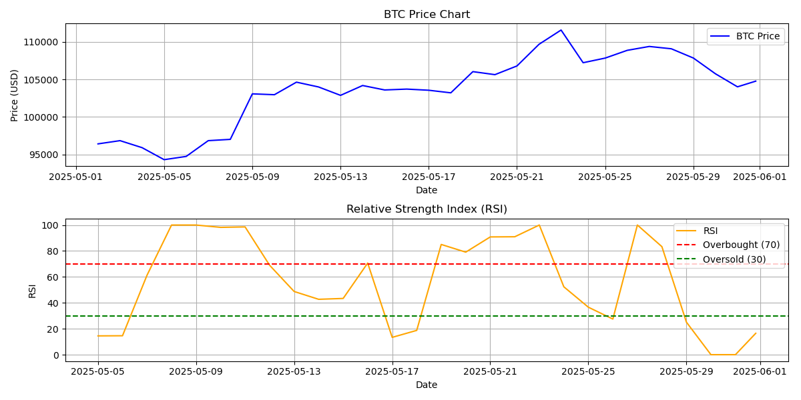

# 📈 AI-Enhanced RSI Trading Signal Bot

A modular, production-ready **Python + Streamlit** trading signal generator that:

- Uses the **Relative Strength Index (RSI)** to detect BUY / SELL / HOLD signals
- Fetches real-time prices from **CoinGecko**
- Sends signals and RSI charts via a **Telegram bot**
- Plots token-wise RSI + portfolio-wide RSI comparison charts
- Schedules auto-runs via **GitHub Actions**
- Offers a visual **Streamlit dashboard** (see link below 👇)

---

## 🌐 Live Streamlit Dashboard

👉 [Open Live App](https://trading-signal-bot-26kpzavuxugamcqquqkdyk.streamlit.app/)  
*Compare RSI charts for ETH, BTC, SOL in real time.*

---

## 🚀 Features

✅ Real-time price feed (ETH, BTC, SOL)  
✅ RSI-based BUY / SELL / HOLD strategy  
✅ Signal logging with timestamp  
✅ RSI + Price chart per token  
✅ Portfolio-wide RSI comparison chart  
✅ Telegram bot alerts with chart + message  
✅ Automated GitHub Actions run (every 6 hours)  
✅ Modular and extendable codebase  
✅ Streamlit dashboard for live charting and testing  

---

## 📦 Folder Structure

```

.
├── app.py                        # Multi-token RSI + Telegram execution
├── dashboard.py (or app.py)     # Streamlit dashboard
├── core/
│   ├── indicators.py             # RSI calculation
│   ├── models.py                 # Token, Signal, Strategy classes
│   ├── price\_source.py           # CoinGecko integration
│   ├── processor.py              # Signal logic + logger
│   └── telegram.py               # Telegram messaging
├── visual/
│   ├── chart.py                  # Token-wise RSI chart
│   ├── portfolio\_chart.py        # Multi-token comparison chart
│   ├── eth\_rsi\_chart.png
│   ├── btc\_rsi\_chart.png
│   ├── sol\_rsi\_chart.png
│   └── portfolio\_rsi\_comparison.png
├── logs/
│   └── signal\_log.txt
├── requirements.txt              # Python dependencies
└── .github/workflows/
└── trading\_signal.yml        # GitHub Actions workflow

````

---

## 🧠 How It Works

1. Fetches the last 30-day prices for ETH, BTC, and SOL
2. Calculates RSI for each token (default window = 14)
3. Applies standard RSI rules:
   - RSI < 30 → BUY
   - RSI > 70 → SELL
   - Otherwise → HOLD
4. Logs signal with timestamp
5. Saves RSI chart for each token
6. Sends chart + signal to Telegram
7. Plots a portfolio-wide RSI comparison chart
8. Streamlit dashboard allows real-time exploration

---

## 🛠️ Setup Instructions

### 🔧 1. Clone & Install

```bash
git clone https://github.com/your-username/trading-signal-bot.git
cd trading-signal-bot
pip install -r requirements.txt
````

### 🔐 2. Add GitHub Secrets

In your repo, go to:
**Settings → Secrets → Actions** and add:

* `BOT_TOKEN`: Telegram Bot API token from [@BotFather](https://t.me/BotFather)
* `CHAT_ID`: Your user ID via [@userinfobot](https://t.me/userinfobot)

---

## 🤖 Run Locally

```bash
python app.py
```

Or test the dashboard:

```bash
streamlit run app.py
```

---

## ☁️ GitHub Actions Automation

* Configured to run every 6 hours (via `cron`)
* Sends Telegram alerts + charts
* Logs signal to file
* Can be manually triggered from the Actions tab

---

## 📊 Example Output

### 🔹 Telegram Message:

```
📊 BTC Trading Signal
Action: BUY
Price: $63,200.10
Time: 2025-05-31 17:12:40
```

With attached chart:


---

## 💡 Future Enhancements

* [ ] Add MACD and Bollinger Band strategies
* [ ] SQLite-based historical storage + dashboard analytics
* [ ] Multi-timeframe RSI support
* [ ] API endpoint via FastAPI or Flask
* [ ] Send summary to email or Discord

---

## 🤝 Contributions

Pull requests welcome!
Use this in:

* AI agent-based trading systems
* Algo trading dashboards
* Quantitative research hackathons
* Blockchain x Finance bots

---

## 📜 License

**MIT License** – Free to use, modify, and share.